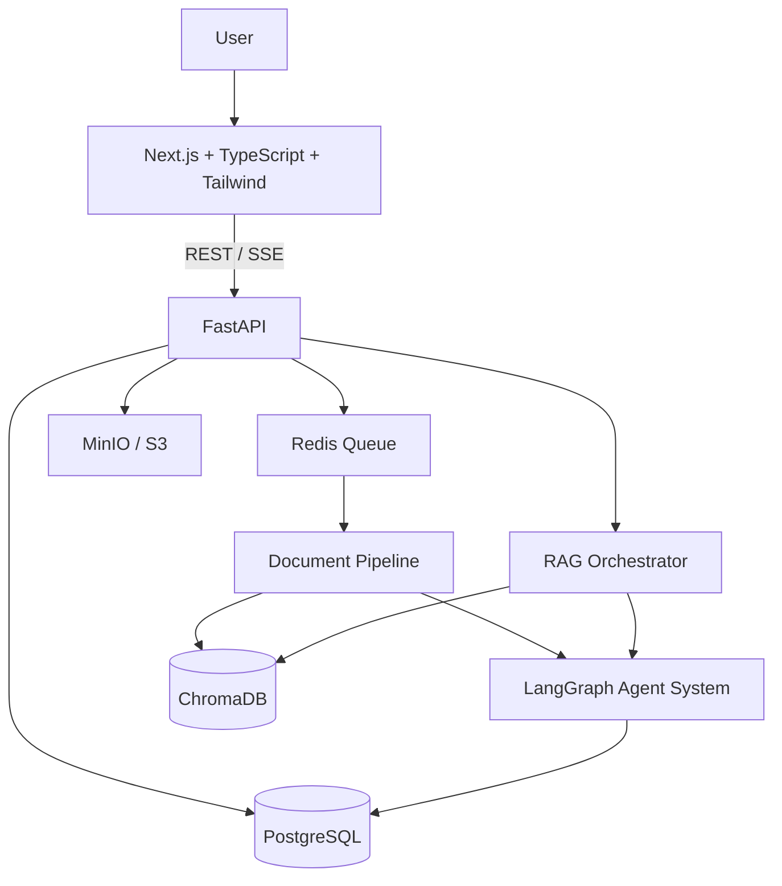
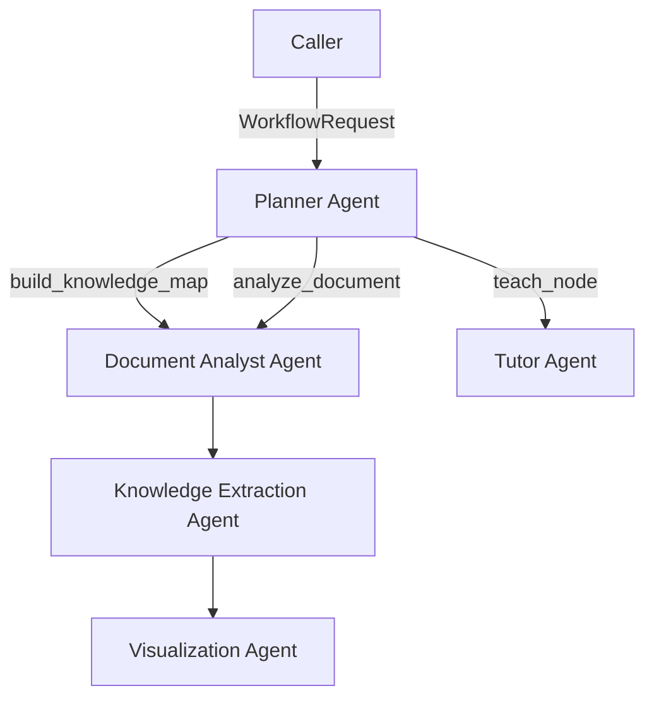

# AI Knowledge Structuring Agent

AI 驱动的文档理解与知识探索系统。用户上传 PDF、DOCX、PPTX 等非结构化资料后，系统生成带来源证据的知识结构，并支持围绕知识节点的可信问答。

## Architecture



## Repository Layout

```text
.
├── AGENTS.md                 # Long-term engineering constraints
├── frontend/                 # Next.js application
├── backend/                  # FastAPI application and workers
├── infra/                    # Docker and service configuration
├── scripts/                  # Local start/stop and deployment helpers
├── docs/                     # ADRs and architecture documentation
├── docker-compose.yml        # Local development environment (bind mounts, hot reload)
└── docker-compose.prod.yml   # Production stack (built images, migrations, health checks)
```

## Prerequisites

- Docker Desktop with Docker Compose v2
- Node.js 20+ and pnpm 9+ (for local frontend development)
- Python 3.11+ and uv (for local backend development)

## Quick Start

第一次使用请看 [docs/LOCAL_INSTALL.md](docs/LOCAL_INSTALL.md)：从安装 Docker 到上传第一份文档的完整步骤，
以及网络、端口、执行策略等常见问题的处理办法。

1. Copy the environment template.

   ```powershell
   Copy-Item .env.example .env
   ```

2. Start the local service stack.

   ```powershell
   .\scripts\start.ps1
   ```

3. Open the frontend at `http://localhost:3000` and the API docs at `http://localhost:8000/docs`.

4. Stop the stack when finished.

   ```powershell
   .\scripts\stop.ps1
   ```

## Production Deployment

The production stack builds both images from source (no bind mounts), runs the
database migrations before the API starts, and keeps every dependency on the
internal network. One command builds and starts it:

```powershell
.\scripts\deploy.ps1          # Windows
```

Windows may block unsigned scripts; `scripts\deploy.cmd` wraps the same command
with `-ExecutionPolicy Bypass` if you prefer double-clicking it.

```sh
sh scripts/deploy.sh          # macOS / Linux
```

Or by hand:

```sh
cp .env.example .env
docker compose -f docker-compose.prod.yml up -d --build
```

The web app is then on `http://localhost:3000` and the API docs on
`http://localhost:8000/docs`. Host ports, credentials, CORS origins and the
address baked into the web bundle are all driven by `.env`; see
[docs/DEPLOYMENT.md](docs/DEPLOYMENT.md) for the variable reference, the
pre-launch checklist and the operations commands.

To hand the running app to someone on the same WiFi, run `.\scripts\link.ps1`
(macOS/Linux: `sh scripts/link.sh`). It prints the address to send, the
localhost one to keep, and whether the stack is actually up.

## Services

| Service | Port | Purpose |
|---|---:|---|
| frontend | 3000 | Next.js user interface |
| backend | 8000 | FastAPI REST/SSE API |
| worker | — | Asynchronous document and AI jobs |
| beat | — | Celery beat scheduler (stale-job reaper) |
| postgres | 5432 | Transactional application data |
| chromadb | 8001 | Vector retrieval store |
| redis | 6379 | Queue and cache |
| minio | 9000 / 9001 | Object storage and console |

## Development Rules

Read [AGENTS.md](AGENTS.md) before making any change. In particular, preserve source evidence for every knowledge node and AI answer, keep long-running work asynchronous, and do not alter architecture without an explicit ADR or approval.

## File Upload

The first implemented feature is `POST /api/v1/uploads`.

- Accepts PDF and DOCX files only.
- Validates both extension and file signature/OpenXML package structure.
- Enforces a 25 MB limit by default (`MAX_UPLOAD_SIZE_BYTES`).
- Saves validated files to `UPLOAD_DIR` (`data/uploads` by default in local development) using a generated storage key.
- Returns a document ID, normalized file metadata, storage key, and upload timestamp.

The frontend root page provides the corresponding upload UI and shows upload, success, and error states.

## Document Processing

`backend/app/pipelines/document_processing/` is an extensible, worker-facing document-to-text pipeline. It has a parser contract and registry rather than a hard-coded file-type branch in the service layer.

- PDF files use PyMuPDF and become page-level sections with page source locations.
- DOCX files use python-docx and become heading-aware sections with paragraph source locations.
- Every parser returns the same `ProcessedDocument` contract: `title`, `sections`, and `metadata`.
- `SourceLocation` is retained with each section so later chunking, knowledge extraction, and citations can link conclusions back to the original material.
- The service is intentionally not exposed by an HTTP endpoint; a future Celery worker will call it after upload, keeping parsing outside request handling.

## Knowledge Extraction

`backend/app/agents/knowledge_extraction/` converts a `ProcessedDocument` into a schema-validated knowledge tree through a bounded LangGraph workflow.

- `prompts.py` contains the versioned prompt template (`knowledge-tree-v1`) and treats document content as untrusted data.
- `KnowledgeTree` and `KnowledgeNode` are Pydantic schemas with forbidden extra fields, bounded text/list sizes, recursive child nodes, and `source_section_indexes` for evidence traceability.
- The production factory uses OpenAI structured output with the JSON Schema method and strict enforcement, then validates the returned object a second time with Pydantic.
- Configure `OPENAI_API_KEY` and `OPENAI_MODEL` in `.env` before constructing the production agent.
- Tests use a deterministic fake structured model; no API key or live LLM request is required.

## Knowledge Map

`frontend/src/features/knowledge-map/` renders the backend `KnowledgeTree` JSON through React Flow.

After an upload the workspace offers two views of the same tree:

| Option | What opens |
| --- | --- |
| 生成思维导图 (mind map) | The structure only: outline, expand/collapse, zoom and pan |
| 生成知识地图 (knowledge map) | The same mind map plus node search, node details and evidence-bound Q&A |

Both open in a dialog that covers the window instead of rendering below the upload panel.

- Five colour themes (紫粉 / 海盐蓝 / 薄荷绿 / 紫罗兰 / 落日橘) can be picked from the swatch row at the top of the
  workspace. The palette lives in `themes.ts` and is applied as CSS variables (`--brand-*`) on the workspace
  wrapper, so the upload screen and the whole map dialog — page wash, buttons, title bars, node cards, branch
  curves, keyword chips, assistant panel and floating pill — switch together.
  The choice is stored in `localStorage` (`knowledge-agent-theme`) and restored on the next visit; blocked or
  unavailable storage simply falls back to the default 紫粉 palette.
- The bottom-left controls zoom in, zoom out, toggle fullscreen, and fit the view. Fullscreen uses the
  browser Fullscreen API and falls back to filling the window when the browser blocks it; Escape leaves
  fullscreen first and only closes the dialog on the next press.
- The canvas keeps the standard arrow cursor (and a move cursor while panning) because the hand cursors
  React Flow uses by default render as a blank pointer on some Windows cursor themes.
- Panning and node dragging are separate gestures: dragging the empty canvas pans the view, while dragging a
  node does one of two things. Dropped on another node it is re-parented there (with its subtree) and the
  branch under the pointer turns green while the drop is valid. Dropped on empty canvas it simply stays where
  the reader put it: that freed position is kept for the node and its subtree, so nothing springs back.
  Dropping a node on its own descendant is refused, the root cannot be moved, and the automatic layout is
  re-applied when the dialog is reopened or another document is opened.
- In fullscreen the map fills the window and the assistant detaches into a floating panel. Clicking a node
  expands it with the node details and the four assistant actions, `收起` collapses it back to a small pill,
  and the enlarged node view still opens above the fullscreen map. The panel header is a drag handle: the
  panel can be parked anywhere on screen, keeps that spot across node changes, and is clamped back into view
  when the window is resized. The collapsed pill drags the same way (a drag parks it, a plain click opens the
  panel where it was left).
- `layout.ts` is a tidy-tree layout split into a balanced mind map: the root sits in the middle, its children
  are divided between the two sides so both carry a similar amount of content, and every parent is centred on
  the span of its children. Nodes on the left mirror the flow direction, so the edges leave and enter the
  correct side of each card.
- The map is editable while it is open: select a node and press Enter (or use the card's `＋ 子节点` button)
  to append a child and open its editor, double-click a card to edit its title and content, and press Delete
  to remove the selected node together with its subtree. Dragging a card onto another card moves it the same
  way. The root can neither be deleted nor moved, and the shortcuts are ignored while a field or button has
  focus. `editing.ts` holds those tree operations as pure functions.
- Every edit is undoable: `Ctrl + Z` steps back through adds, renames, deletes, re-parents and free-position
  drags (the header has 撤销 / 重做 buttons too, with `Ctrl + Shift + Z` or `Ctrl + Y` for redo). The dialog
  keeps a 50-step history of the tree together with the freed positions, so undoing a drag restores the
  previous level and an undo never touches the underlying document.
  `下载 XMind` is the save path for those edits: it exports the tree exactly as it stands, and the workspace
  keeps the edited tree while the page stays open (closing and reopening the map keeps it). Nothing is written
  back to the backend yet, so a page refresh drops unsaved edits. Reader-created nodes are drawn with a dashed
  border and marked `本地`.
- `下载 XMind` exports the map as it stands (reader edits included) as a `.xmind` file. `xmind.ts` writes the
  XMind 2020+ `content.json` sheet/topic structure using the balanced map layout
  (`org.xmind.ui.map.unbalanced`, the structure XMind itself gives a new map), keeps node summaries as topic
  notes, and packs it with a small stored-entry ZIP writer so the export adds no dependency.
- `graph.ts` turns the tree into React Flow nodes/edges and exposes `flowPathForNodeId` /
  `ancestorPathIds` so search can expand and centre a node.
- `search.ts` + `NodeSearch.tsx` filter nodes by title, summary or keywords and highlight the match.
- `KnowledgeMapNode` renders one node with expand/collapse, selection and search-highlight styling.
- Double-clicking a node opens `KnowledgeNodeDialog`: the enlarged view shows the complete summary
  (the card clamps it to two lines), its keywords, its source sections, and the question panel when the
  knowledge map is open.
- `KnowledgeNodeDetails` shows the selected node's summary, keywords and evidence sections.
- `KnowledgeNodeQa` asks the backend a question about the selected node and renders the grounded answer
  with its citations, or the refusal when the evidence is insufficient.
- `KnowledgeMapDialog.tsx` composes the canvas with the optional details/QA sidebar.
- Wheel behaviour: the wheel pans the canvas, `Ctrl` + wheel zooms, dragging pans, and the toolbar offers
  展开全部 / 收起全部.

## Document Outline

The map mirrors the document's own structure, so structure detection happens during parsing:

| Source | Strategy |
| --- | --- |
| DOCX | Word heading styles (`Heading 1`, `标题 1`, …), explicit outline levels (`w:outlineLvl`), and numbered headings (`第X章`, `一、`, `（一）`) all become outline levels; front matter before the first heading becomes a `前言` node beside the chapters |
| PDF with bookmarks | The embedded outline (`get_toc`) defines chapters and their pages; unnumbered entries that a document mis-styles as headings (long sentences sitting beside a numbered item) are folded into that item instead of becoming nodes of their own |
| PDF without bookmarks | Numbered headings such as `第X章`, `一、`, `（一）` and `1.1` are detected per line, with font size as a secondary hint |
| Labelled blocks | Inline labels the documents use as sub-headings (`传统发展痛点:`, `数字化赋能路径:`, `赋能成效:`, `典型案例:`) become third-level nodes, with the text after the colon as their body |
| Stylised chapter openers | A short line directly followed by `一、二、三` sections becomes a chapter node, numbered after the previous chapter (`第六章 …`) even when OCR loses the `第X章` marker |
| Fallback | One section per page |

Outline levels follow the document's own conventions: chapters are level 1, `一、` sections level 2,
Chinese-numeral brackets `（一）` level 3, and Arabic brackets `(1)` level 4, so labelled blocks keep their
list items nested underneath instead of flattening into siblings.

Numbered headings take priority over styles because papers frequently style every chapter with Word's
`Title` style, which on its own carries no usable depth. When `docProps` has no title, the document title
falls back to the opening content line before the filename is used.

Front matter that precedes the first heading — an abstract or keyword block — becomes a `前言` node that
sits beside the chapters rather than above them, in both the DOCX and PDF parsers. Without that alignment a
document whose chapters are numbered with `一、` would nest every chapter under its own abstract.

Labelled blocks are matched on more than the exact wording, because scans mangle them:

- both `:` and `;` act as the separator (`数智化赋能成效; 形成…`);
- a garbled label such as `RRR RB:` or `BE ACN RE:` is repaired by position in the section
  (痛点 → 路径 → 成效) plus its wording (`形成…` means 成效);
- only first-level headings are deduplicated, so `传统发展痛点` legitimately reappears in every section;
- repeated case studies are named after their case (`典型案例：长飞光纤…`) instead of appearing twice
  with the same title.
- parallel numbered points (`(1) … (2) … (3) …`) become fourth-level nodes under their label, even when the
  scan packs several of them onto one line or leaves the marker at the end of a line:
  `…技术沉淀; (2)` + `固化为算法模型…` is re-joined into `(2) 固化为算法模型…`.
  Each point becomes a short title (`(3) 系统匹配`) plus its wording as the node body, and a numbered list
  that appears outside a labelled block stays ordinary body text.

Contents pages are recognised (dot leaders or a trailing page reference on most lines) and skipped, and
repeated headings are deduplicated, so a table of contents never becomes a duplicate chapter. Parsers
report where the structure came from in `DocumentMetadata.structure_source`
(`docx_headings`, `pdf_outline`, `detected_headings`, `pages`).

The knowledge tree then nests sections by level: the root is the document title, its children are the
first-level sections, and deeper headings nest underneath. A chapter node covers its own section plus
every descendant section, which is also what its evidence links point at.

### Node summaries and keywords without a model

`app/agents/knowledge_extraction/text_digest.py` keeps the fallback readable when no chat model is
configured:

- `summarize` picks the single most representative sentence of a section (term-weighted centroid scoring,
  capped at 80 characters) instead of copying a long excerpt, so a node shows a one-line takeaway.
- `extract_keywords` derives keywords from the section text using boundary-aware Chinese spans, n-grams and
  document frequency, and never returns function words or fragments of a phrase the document states whole.
- Fragments that contain no real content (for example an OCR page that only holds a page number) are
  detected and ignored, so a node never gets summarized as `-17-`.

With `OPENAI_API_KEY` configured the model produces the summary and keywords instead, and the same schema
validation still applies.

### With a model: structure from the document, content from the model

When a chat model is configured the pipeline does **not** let the model redesign the map. It builds the
outline deterministically and then asks the model to rewrite each node:

- `build_structural_tree` produces the skeleton (chapters, sections, labelled blocks) from the document.
- `knowledge_extraction/enrichment.py` batches the nodes per chapter and asks for one factual sentence plus
  3-6 keywords per node. Nodes the model does not answer keep their extractive wording, so the map is never
  left empty.
- A title may be repaired (`内洒` → `内涵`, `挖气` → `挖掘`) but only when the numbering prefix is unchanged,
  the length differs by at most four characters and the similarity to the original is at least 0.6.
- Model output is validated leniently: required fields must be present, unknown extra fields are ignored so a
  chatty provider cannot break the run.

Provider notes: OpenAI uses strict `json_schema`; DeepSeek and other OpenAI-compatible gateways switch to
function calling automatically via `LLM_STRUCTURED_OUTPUT=auto`.

## Retrieval and Node Q&A (RAG)

`backend/app/pipelines/chunking/`, `backend/app/embeddings/`, `backend/app/vectorstores/`,
`backend/app/retrieval/` and `backend/app/agents/node_qa/` implement the retrieval pipeline described in
[docs/adr/0001-rag-pipeline.md](docs/adr/0001-rag-pipeline.md).

1. **Chunking** — parsed sections become `content_chunks` with section index, chunk index, page or
   paragraph location and character offsets. Chunk ids are deterministic, so re-indexing is idempotent.
2. **Embedding** — `EMBEDDING_PROVIDER=deterministic` (default) hashes tokens locally and needs no API
   key; `EMBEDDING_PROVIDER=openai` uses `OPENAI_EMBEDDING_MODEL` through an OpenAI-compatible endpoint.
3. **Vector store** — chunks are indexed in ChromaDB under the `document_id` metadata filter. ChromaDB is
   a derived index: chunk text and citations always come from PostgreSQL.
4. **Retriever** — a question is embedded, searched inside the document, re-ranked with a boost for the
   node's own evidence chunks, and filtered by `RETRIEVAL_MIN_SCORE`.
5. **Answer** — the node Q&A LangGraph workflow drafts an answer, then validates that every cited chunk id
   was actually retrieved. Answers without a verifiable citation are converted into a refusal.

### Evidence model

`evidence_links` is the only bridge between generated artifacts and content blocks. Each row points at one
chunk and at one target (`knowledge_node`, `knowledge_edge` or `answer`) and stores the quote, rank and
relevance. Deleting or rebuilding the vector index never removes the ability to render citations.

### API

| Method | Path | Purpose |
| --- | --- | --- |
| `POST` | `/api/v1/documents/{id}/processing` | Queue parsing, chunking, embedding and indexing |
| `GET` | `/api/v1/documents/{id}` | Document, indexing and knowledge-tree status |
| `POST` | `/api/v1/documents/{id}/knowledge-tree` | Queue knowledge extraction |
| `GET` | `/api/v1/documents/{id}/knowledge-tree` | Persisted knowledge tree with node ids |
| `POST` | `/api/v1/knowledge-nodes/{id}/questions` | Queue a grounded question about one node |
| `GET` | `/api/v1/questions/{id}` | Answer, refusal reason and citations |

Long-running parsing, embedding and model calls only run inside Celery tasks; the HTTP layer queues work
and polls state.

## Node AI Assistant

Every node carries four assistant capabilities on top of the free-form question box:

| Capability | Intent | What it does |
| --- | --- | --- |
| 解释这个节点 | `explain` | Explains the node in plain language, starting from its definition |
| 举例说明 | `example` | Prefers cases, numbers and 案例 from the context; says so when the document has none |
| 深入学习 | `deep_dive` | Breaks the node into sub-points and points at what to read next |
| 生成测试问题 | `quiz` | 3-5 answerable questions with reference answers, each with its own citations |

All four are answered from a single artefact — the **Node Context**
([`backend/app/agents/node_qa/context.py`](backend/app/agents/node_qa/context.py)) — which contains the node's
identity, its outline path, one level of children, sibling titles and up to six labelled evidence blocks
quoted from the document. The mechanism, invariants and alternatives are described in
[ADR 0001](docs/adr/0001-rag-pipeline.md) section 10.

```powershell
# intent-only request; question is optional
curl -X POST http://localhost:8000/api/v1/knowledge-nodes/<node-id>/questions `
  -H "Content-Type: application/json" -d '{"intent":"quiz"}'
```

Without a model the assistant degrades to verbatim quotes (`explain`/`ask`) or outline-derived questions
(`quiz`), and says so in `answer_mode`.

## Multi-Agent Workflow

The AI layer is orchestrated by one LangGraph workflow (`backend/app/agents/workflow/`) instead of isolated
single LLM calls. See [ADR 0002](docs/adr/0002-multi-agent-architecture.md) for the state design and the
routing rules.



| Agent | Responsibility | Uses a model? |
| --- | --- | --- |
| Planner | Analyses the request, decides the task type and the ordered step list | Optional (rules always decide the route) |
| Document Analyst | Parses the file, produces the digest, outline and warnings | No |
| Knowledge Extraction | Builds the outline skeleton, enriches node content, persists nodes and evidence | Yes when configured |
| Visualization | Converts persisted nodes into `knowledge-map-v1` nodes/edges and stores it on the document | No |
| Tutor | Explains, exemplifies, deep-dives or quizzes one node from its Node Context | Yes when configured |

Every step appends to an append-only journal (`traces`), so `docker compose logs worker` explains exactly which
agent ran, whether a model was used and how long it took.

### Job reliability

Long jobs run in Celery with explicit limits, so a hung provider or a killed worker cannot leave the UI
polling forever:

- **Time limits**: indexing and knowledge-tree builds get 1800 s soft / 2100 s hard; answering gets 120 s /
  180 s; the reaper 60 s / 120 s.
- **Late acknowledgement**: `task_acks_late`, `task_reject_on_worker_lost` and
  `worker_prefetch_multiplier=1`, so a lost worker returns its task to the queue.
- **Retries with backoff**: transient failures (timeouts, connection resets, rate limits, provider 5xx) are
  retried `TASK_MAX_RETRIES` times with exponential backoff and jitter; permanent failures (schema
  validation, bad ids, auth) are not retried. See `app/workers/retry_policy.py`.
- **Model timeouts**: every chat/embedding client is built with `LLM_REQUEST_TIMEOUT_SECONDS` and
  `LLM_MAX_RETRIES`.
- **Stale-job reaper**: the `beat` service runs `maintenance.reap_stale_jobs` every
  `REAPER_INTERVAL_SECONDS`. Anything still `indexing` / `building` / `running` after
  `STALE_JOB_TIMEOUT_SECONDS` is marked failed with `error_code=stale_job`, which stops the frontend polling.
  Run it on demand with:

  ```powershell
  docker compose exec -T worker python -c "from app.workers.tasks import reap_stale_jobs_task; print(reap_stale_jobs_task())"
  ```

### Degraded modes

When no chat model is configured the pipeline stays usable and honest:

- knowledge extraction is replaced by the document's own heading structure (`tree_mode=structure_fallback`);
- answers are verbatim quotes from retrieved chunks (`answer_mode=extractive_fallback`).

Both modes are reported by the API so the UI labels them. Neither invents content.

## Scanned Documents (OCR)

`backend/app/pipelines/document_processing/ocr.py` adds an OCR fallback for PDFs without a text layer.

- A page whose extracted text is shorter than `OCR_MIN_TEXT_CHARACTERS` is rasterised at `OCR_DPI` and
  passed to Tesseract with `OCR_LANGUAGES` (default `chi_sim+eng`). The default is now 300 dpi, which
  measurably improves small Chinese headings on scanned pages; `OCR_PSM` and the optional
  `OCR_BINARIZE` / `OCR_BINARIZE_THRESHOLD` preprocessing are available when a scan needs them.
- `OCR_FALLBACK_DPI` (default 200) runs a second pass per page and keeps whichever result preserves more
  document structure (chapter headings first, then section headings, then characters). Scans are unstable
  across resolutions: the same page can lose `第四章` at 300 dpi while gaining `特色化`. Set
  `OCR_FALLBACK_DPI=` to disable the second pass and roughly halve OCR time.
- OCR-confused numerals inside brackets are normalised before the title is stored, so `(=) 梯度赋能…`
  becomes `(二) 梯度赋能…`. Decimal numbers in body text (for example `2.6 倍; 研发人员占比…`) are no
  longer mistaken for `1.1`-style section headings.
- OCR runs inside the Worker; `OCR_MAX_PAGES` bounds the cost of very large scans and a page that fails
  OCR is skipped with a warning instead of failing the whole document.
- `documents.ocr_page_count` records how many pages were recognised through OCR, and the UI tells the
  user when a document was read that way.
- Tesseract and the English/Chinese language packages are installed in `backend/Dockerfile`. Code changes
  need no rebuild, but changing the OCR stack requires `docker compose build backend worker`.

### Failure codes

`GET /api/v1/documents/{id}` returns a stable `error_code` next to the technical `error_message`, so the
UI can explain failures in the user's language:

| `error_code` | Meaning |
| --- | --- |
| `no_text_layer` | The PDF has no extractable text (scanned document, or OCR disabled/unavailable) |
| `unsupported_format` | No parser is registered for the file type |
| `processing_failed` | Any other parsing or indexing failure |

## Database Migrations

Schema changes are managed with Alembic inside the backend image:

```powershell
docker compose run --rm --no-deps backend alembic upgrade head
```

## Verification

```powershell
# Backend (pytest and httpx are installed into a throwaway container)
docker compose run --rm --no-deps backend sh -c "pip install --no-cache-dir pytest httpx >/dev/null 2>&1; python -m pytest tests -q -p no:cacheprovider"

# Frontend
docker compose run --rm --no-deps frontend pnpm test
docker compose run --rm --no-deps frontend ./node_modules/.bin/tsc --noEmit

# End-to-end: upload -> index -> knowledge tree -> cited answer
docker compose run --rm --no-deps -v "D:\X\codex项目\scripts:/scripts:ro" backend sh -c "pip install --no-cache-dir httpx >/dev/null 2>&1; python /scripts/smoke_rag_pipeline.py"
```
