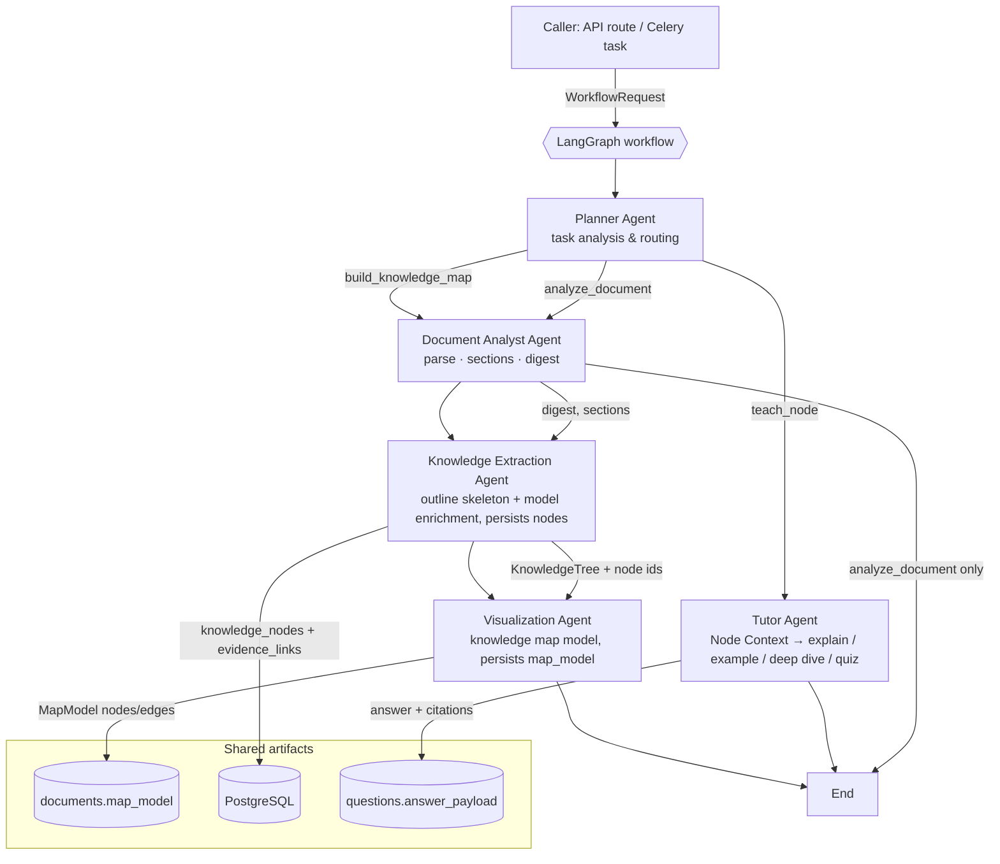

# ADR 0002 — Multi-agent workflow for document understanding

- Status: Accepted
- Date: 2026-09-13
- Scope: AI orchestration layer (`backend/app/agents/workflow/`)
- Supersedes: the single-call design where each service invoked one agent directly

## 1. Problem

The AI layer grew into three independent single-shot calls: knowledge extraction was one model call with the
whole document, node answers were one model call with a node context, and the map was assembled ad hoc in the
service. Nothing decided *what* work was needed, nothing recorded *which* steps ran, and a request that needed
two capabilities had to be wired by hand in each caller. Adding a capability meant touching every caller.

## 2. Decision

Introduce one LangGraph workflow that runs five specialised agents under a Planner, plus a shared, typed state.
Callers submit a `WorkflowRequest`; the Planner turns it into an ordered plan; the graph executes the plan
step by step, journalling every step.

### 2.1 Agent relationship diagram



Consumption rules: the Knowledge Extraction Agent consumes `sections` from the Document Analyst and produces
the persisted tree; the Visualization Agent consumes persisted nodes (never the in-memory tree) so its ids are
real; the Tutor Agent shares nothing with the document pipeline except the persisted nodes and content blocks.

### 2.2 State design

`WorkflowState` (`app/agents/workflow/state.py`) is a `TypedDict` where each agent owns one key:

| Key | Type | Written by | Read by | Notes |
| --- | --- | --- | --- | --- |
| `request` | `WorkflowRequest` | caller | Planner, all agents | Task type, ids, intent, question, free-form instruction |
| `deps` | `WorkflowDependencies` | caller | all agents | Session, upload dir, injected factories (never serialised) |
| `plan` | `WorkflowPlan` | Planner | router, every step | `task_type`, ordered `steps`, `reason`, `analysed_by` |
| `current_step` | `int` | runner | router | Index into `plan.steps`; the loop advances it after each agent |
| `status` | `str` | runner | router, service | `pending → running → succeeded / degraded / failed` |
| `digest` | `DocumentDigest` | Document Analyst | service, logs | Title, structure source, counts, outline preview, warnings |
| `sections` | `list[DocumentSection]` | Document Analyst | Knowledge Extraction | Non-empty sections in document order |
| `processed` | `ProcessedDocument` | Document Analyst | Knowledge Extraction | Full parse result, keeps section indexes aligned with chunks |
| `tree` | `KnowledgeTree` | Knowledge Extraction | Visualization (via DB) | Schema-validated structure |
| `knowledge` | `KnowledgeDraft` | Knowledge Extraction | Visualization, service | Mode (`llm` / `structure_fallback`), node count, depth |
| `root_node_id` | `UUID` | Knowledge Extraction | service, API | Persisted root id |
| `map_model` | `MapModel` | Visualization | service, API | `knowledge-map-v1` view model (nodes, edges, stats) |
| `tutor` | `TutorReply` | Tutor | service | Answer, citations, quiz items, refusal, truncation flag |
| `traces` | `Annotated[list[AgentTrace], operator.add]` | every step | service, logs | Append-only journal: agent, status, detail, duration, used_model |
| `errors` | `Annotated[list[str], operator.add]` | failed step | service | Append-only failure reasons |

Two properties matter:

1. **Additive artifacts.** No agent overwrites another agent's key, so a partially completed run is still
   inspectable and a failed step leaves the earlier artifacts untouched.
2. **Reducer-backed journal.** `traces`/`errors` use `operator.add`, which is the LangGraph idiom for
   accumulating history instead of replacing it. Everything else uses last-write-wins.

### 2.3 Workflow code

```python
# app/agents/workflow/graph.py (abridged)
graph = StateGraph(WorkflowState)
graph.add_node(AgentName.PLANNER, planner_node)      # analyse the request
graph.add_node(EXECUTE_STEP, execute_step)           # run the current plan step
graph.add_edge(START, AgentName.PLANNER)
graph.add_edge(AgentName.PLANNER, EXECUTE_STEP)
graph.add_conditional_edges(
    EXECUTE_STEP,
    route_after_step,                                # "continue" | "done"
    {"continue": EXECUTE_STEP, "done": END},
)
```

`execute_step` looks up `plan.steps[current_step]`, dispatches to the matching agent, times it, and returns
`{artifact…, "traces": [trace], "current_step": index + 1}`. `route_after_step` stops on failure or when the
plan is exhausted, so the loop is bounded by the plan length.

Files:

| File | Responsibility |
| --- | --- |
| `workflow/state.py` | State, payload models, `WorkflowRequest`, `WorkflowDependencies` |
| `workflow/planner.py` | Planner Agent: rules decide the route, the model may refine it |
| `workflow/document_analyst.py` | Document Analyst Agent: parse, digest, warnings |
| `workflow/knowledge_extraction.py` | Knowledge Extraction Agent: skeleton + enrichment + persistence |
| `workflow/visualization.py` | Visualization Agent: map model + evidence-coverage check |
| `workflow/tutor.py` | Tutor Agent: Node Context, answer, citation/quiz validation |
| `workflow/graph.py` | Graph assembly, runner, collaborator wiring |

### 2.4 Safety and degradation

- **Planner cannot invent work.** Rules always produce the executable step list; a model-refined task type is
  only accepted when it maps to a known route (`TASK_ROUTES`). An unknown instruction cannot add steps.
- **Bounded loop.** The router stops after the last planned step; a failing agent stops the run and records the
  error instead of retrying forever.
- **Degraded, never silent.** When a model is configured but enrichment fails, the run is marked `degraded`
  and the tree mode stays `structure_fallback`. Without a model entirely, Tutor answers are extractive and
  quizzes are derived from child nodes; both are labelled in the API.
- **Evidence alignment.** The Knowledge Extraction Agent verifies that stored content blocks still match the
  freshly parsed sections (same section index → same title) and rebuilds them when they do not, so node
  evidence can never point at a stale section. Without this check a parser change silently produced 34 nodes
  without evidence; after it, 2 of 73.
- **Journal.** `docker compose logs worker` shows one line per agent with duration and `used_model`, e.g.
  `document_analyst 165271ms`, `knowledge_extraction 26784ms used_model=True`, `visualization 16ms`.

## 3. Alternatives considered

| Alternative | Why rejected |
| --- | --- |
| Keep one LLM call per capability, wire callers by hand | No task analysis, no journal, every new capability touches every caller |
| Supervisor agent that free-form calls tools in a loop | Unbounded cost and untestable routing; refusals become unpredictable |
| Separate graph per capability (three graphs) | Duplicated state, no shared journal, no single place explaining "what ran" |
| Agents calling each other directly instead of via state | Hidden coupling: an agent change breaks its caller rather than the contract |
| Persisting every intermediate artifact | Extra migrations for data nobody reads; the journal plus final artifacts are enough |

## 4. Impact and rollout

- `KnowledgeTreeService.build` and `QuestionService.answer` are now thin wrappers: they own document/question
  status transitions, the workflow owns the AI orchestration.
- New column `documents.map_model` (JSON) stores the Visualization Agent output; `GET
  /documents/{id}/knowledge-tree` returns it as `map`.
- No new external service, no queue change, and no change to the evidence data model.
- Rollback: the individual agents remain callable on their own (`build_structural_tree`, `NodeQuestionAgent`,
  `DocumentProcessingService`), so reverting means pointing the services back at them.

## 5. Verification

`tests/agents/test_workflow.py` covers planner routing (document → map route, node → tutor, explicit task type,
missing identifiers), analysis-only runs, the full three-agent pipeline, persistence of tree and map model,
tutor replies through the workflow, stale-chunk rebuilding, and failure short-circuiting. The full backend
suite (127 tests) and the frontend suite (29 tests) pass.
